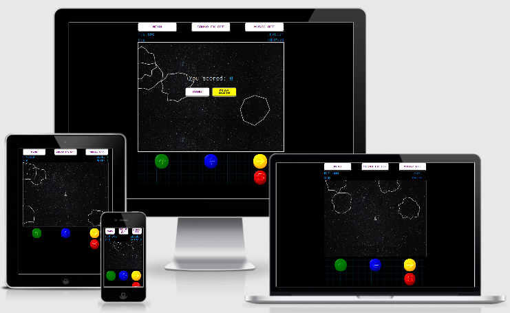
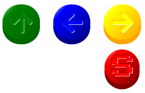

- [Overview](#overview)
- [UX](#ux)
  - [User Stories](#user-stories)
  - [Design](#design)
    - [Color Scheme](#color-scheme)
    - [Icons](#icons)
    - [Typography](#typography)
  - [Wireframes](#wireframes)
- [Features](#features)
  - [Existing Features](#existing-features)
  - [Future Features](#future-features)
- [Technologies Used](#technologies-used)
  - [Front-End Technologies](#front-end-technologies)
  - [Miscellaneous Technologies](#miscellaneous-technologies)
- [Agile Project Management](#agile-project-management)
- [Testing](#testing)
- [Deployment](#deployment)
- [Credits](#credits)
  - [Media](#media)
  - [Acknowledgments](#acknowledgments)

 

---

## Overview

Shooty Rocks is an endless space shooter arcade game inspired by the classic 1979 [*Asteroids*](https://en.wikipedia.org/wiki/Asteroids_(video_game)) game. You can play the deployed game [here](https://leithdm.github.io/shooty-rocks/).

 

## UX

This project is part of the [Code Institute](https://codeinstitute.net/) Full Stack Software Development course, specifically **Module 2: Interactive Front-End Development**. The objective for this milestone project is to "*build an interactive front-end site. The site should respond to the users' actions, allowing users to actively engage with data, alter the way the site displays the information to achieve their preferred goals.*"

The inspiration for developing this game came from the classic Asteroids game conceived by Lyle Raines who was Atari's vice president of engineering in 1979. Ed Logg eventually took the lead on the project and is credited with its programming.

 

### User Stories

- User Stories were written from the perspective of the user, and are detailed below (in no particular order).

 

"**__As a *user*, I__** ______________________________________________"

- need to have a responsive game, playable from any device (mobile, tablet, desktop).
- should have an invincibility shield for a set period of time when game restarts.
- should see GAME OVER when I lose all my lives.
- should progress through the game via Levels i.e. Level 1, Level 2, etc.
- should have a triangular ship to match the original game.
- should see irregular shaped asteroids.
- should see an explosion when I shoot an asteroid.
- should be able to turn soundfx on and off as a menu option.
- should hear different sound-fx while playing the game.
- should have a visual cue for the number of lives I have during the game.
- should be able to shoot the asteroids with bullets.
- should be able to shoot bullets using keyboard input.
- should be able to move the ship using keyboard input.
- should be able to move my ship forwards, backwards, left, and right.
- should have my ship render onto the centre of the canvas at the start of the game.
- should feel friction when my ship is no longer moving forward, and my ship should finally stop.
- should be given 3 lives at the start of the game.
- should have a visual cue (explosion) when my ship is hit by an asteroid.
- should have a visual cue (afterburner at back of ship) when my ship is thrust forward.
- should see my score increment every time I shoot an asteroid. Different asteroids get different points.
- should see my ship reappear on the opposite side of the screen if I move off-screen.
- should see the large and medium sized asteroids break up into x2 smaller asteroids when hit by a bullet.
- should find the game easy to begin with, and as the game progresses it should get increasingly more difficult.
- should be able to shoot bullets by tapping a "FIRE" button when on mobile.
- should be able to move the ship using swipes or a button keypad when playing the game on mobile.
- should be able to click on a HIGH SCORES menu button, and be presented with the highest score.

 

### Design

Mobile responsiveness was a key consideration in this project, and resulted in the development of a gamepad controller in order to move the ship when playing on mobile. The use of responsive CSS sizing elements including `vw` , `vh` and `grid` helped to ensure the site responds to the appropriate device, along with my own `container` element that is functionally the same as a [Bootstrap container](https://getbootstrap.com/docs/4.5/layout/overview/) but without the overhead of using the framework.

 

#### Color Scheme

-  purple text/background
-  red button
-  yellow button/text
-  green text
-  blue dashboard (score, level, lives)
- All of these colors are set at `:root` level within the [style.css](assets/css/style.css) file. The use of css custom properties (variables) is in keeping with the principles of DRY.

- The gamepad color scheme is loosely based on the [SNES](https://en.wikipedia.org/wiki/Super_Nintendo_Entertainment_System) controller:

#### Icons

- [Font Awesome 5.6.1](https://fontawesome.com/) icons are used in the [how to play](how-to-play.html) page, and in the gamepad controller buttons.

 

#### Typography

- [Google Fonts](https://fonts.google.com/) were used across the site, namely:
  - [Press Start 2P](https://fonts.google.com/specimen/Press+Start+2P) : game title and menu buttons.
  - [Roboto Mono](https://fonts.google.com/specimen/Roboto+Mono) : in-game dashboard including score, highscore, ships, level.

 

### Wireframes

- Wireframes were created using [Balsamiq Wireframes](https://balsamiq.com/) and can be viewed by clicking on links below.

 

|    Home Page   |    Sound-Options.html     |    High-Scores.html    |
|    :----:      |    :----:                 |    :----:              |
|[Desktop/Mobile](wireframes/home-page.png)|[Desktop/Mobile](wireframes/sound-options.png)|[Desktop/Mobile](wireframes/high-scores-page.png)|

 

---

## Features

### Existing Features
  - **Progressive Difficulty:** the game is an endless space shooter arcade game. The game starts at Level 1, and becomes increasingly more difficult as each level progresses. This is implemented by increasing the number of asteroids, and increasing the speed at which the asteroids move.
  - **Play Again:** Once the game is over, a pop up screen allows the user to play again, or exit to the main menu.
  - **Sound FX / Music:** option to turn Sound FX and background Music on/off from within the game. These setting options are stored in local storage.
  - **How to Play:** a menu item to explain how to play the game on both Desktop and Mobile.
  - **High Score:** a menu item to display the highest score achieved. High score is also displayed within the game to provide extra incentive to the user. This value is stored in local storage.
  - **In-game Dashboard:** displaying High Score, Score, Level, Ships, and buttons for navigating back to the main menu and for controlling sound fx/music.
  - **Gamepad Controller:** built for mobile users. Designed with large buttons and positioned for ease of use. The gamepad controller is also hidden on large (>992px) devices and replaced with a background pattern.

 

### Future Features
A full list of future features **can be viewed in the [Product Backlog](https://github.com/leithdm/milestone-project-2/projects/1)**, but we will briefly mention some of them here:
- **In-game enhancements:** alien space ships that shoot at player, extra-lives, flashier explosions/collisions, game-over music, different backgrounds for different levels.
-  **Menu Items:** high score Leaderboard, e.g. top 10 high scores.

 

---

## Technologies Used

### Front-End Technologies

- [HTML5](https://en.wikipedia.org/wiki/HTML5) - used to provide content and structure.
- [CSS3](https://en.wikipedia.org/wiki/Cascading_Style_Sheets) - used to provide styling.
- [JavaScript ES6](https://developer.mozilla.org/en-US/docs/Web/JavaScript) - the game is built entirely from vanilla JavaScript.
- [Jasmine](https://jasmine.github.io/) - used for Test-Driven Development (TDD).
- [Howler.js](https://github.com/goldfire/howler.js#documentation) - an audio library for the modern web.
- [Google Fonts](https://fonts.google.com/) - used to provide font styling.
- [Am I Responsive?](http://ami.responsivedesign.is/) - used to show site responsiveness.

 

### Miscellaneous Technologies

- [VS Code](https://code.visualstudio.com/) - used as the primary IDE.
- [GitHub](https://github.com/) - used for remote storage of code.
- [TinyPNG](https://tinypng.com/) - used to optimize (.jpg, .png) images for faster loading.
- [Balsamiq](https://balsamiq.com/) - used to create the project's wireframes.

 

---

## Agile Project Management

[GitHub Projects](https://github.com/features/project-management/) was used to iteratively sprint through the development of this app. Each *User Story* became an individual *Issue*, and was placed in a Kanban board composed of the following columns:
1. **Backlog** - all user stories, ordered by value/priority.
2. **Sprint** - a subset of user stories to be completed in a x1 week sprint.
3. **In Progress** - user stories currently being worked on from current sprint.
4. **Done** - user stories completed, and tested.

 A separate git branch was created for each user story, and a Pull Request (PR) was submitted for its subsequent approval/merger into the master repository. Along with tracking user stories, Github Projects was also used to track bugs. **The full list of user stories/bugs and their relevant PR's can be viewed [here](https://github.com/leithdm/milestone-project-2/projects/1).**

 

---

## Testing

The testing process can be viewed [here](TESTING.md).

 

---

## Deployment

**How to deploy**

To deploy this page to GitHub Pages from its [GitHub repository](https://github.com/leithdm/milestone-project-2), the following steps were taken:

1. From the menu items near the top of the page, select **Settings**.
2. Scroll down to the GitHub **Pages** section.
3. Under **Source** click the drop-down menu labelled **None** and select **Master Branch**.
4. The page refreshes automatically, and the website is now deployed.
5. Scroll back down to the **GitHub Pages** section in **Settings** to retrieve the link to the deployed website. It may take a short time to go live, but typically < 60 seconds.

 

**How to run locally:**

To clone this project from GitHub:

1. Under the repository’s name, click **Clone or download**.
2. In the **Clone with HTTPS** section, copy the given URL.
3. In your IDE of choice, open **Git Bash**.
4. Change the current working directory to the location where you want the cloned directory to be made.
5. Type **git clone**, and then paste the URL copied in Step 2

`git clone https://github.com/leithdm/milestone-project-2.git`

1. Press **Enter**. Your local clone will be created.

 

---

## Credits

### Media

- Audio:
  - [Classic Gaming](http://www.classicgaming.cc/classics/asteroids/) provided the in-game [Sound FX](http://www.classicgaming.cc/classics/asteroids/sounds). These are the same sounds used in the original *Asteroids 1979* arcade classic.
  - Background music was provided royalty free by [DL Sounds](https://www.dl-sounds.com/royalty-free/andromeda-journey/).
  - Audio compression and conversion was provided via [FreeConvert](https://www.freeconvert.com/mp3-to-webm).
- Images:
  - The [background image]([https://link](http://www.classicgaming.cc/classics/asteroids/graphics)) used in the game menu was again provided by [Classic Gaming](http://www.classicgaming.cc/classics/asteroids/). A filter was applied to darken the image.
  - The in-game star background was provided by [Jake Weirick](https://unsplash.com/photos/Q_RBVFFXR_g) via [Unsplash](https://unsplash.com/).
  - The patterned background visible on desktop was provided by [Hero Patterns](http://www.heropatterns.com/).
- Game Programming Tutorials:
  - [Make JavaScript Asteroids in One Video](https://www.youtube.com/watch?v=HWuU5ly0taA&ab_channel=DerekBanas): a great introductory video.
  - [Code Asteroids in JavaScript (1979 Atari game) - tutorial](https://www.youtube.com/watch?v=H9CSWMxJx84&ab_channel=freeCodeCamp.org): another excellent tutorial.
  - [Canvas](https://developer.mozilla.org/en-US/docs/Web/API/Canvas_API/Tutorial) tutorials provided by [MDN web docs](https://developer.mozilla.org/en-US/).
  - [Code Your First Game: Arcade Classic in JavaScript on Canvas](https://www.udemy.com/course/code-your-first-game/): a free course on [Udemy](https://www.udemy.com/).
  - [How to Program Games: Tile Classic in JS for HTML5 Canvas](https://www.udemy.com/course/how-to-program-games/): a paid course on [Udemy](https://www.udemy.com/).

 

### Acknowledgments

- [Precious Ijege](https://www.linkedin.com/in/precious-ijege-908a00168/?originalSubdomain=ng) - for his mentorship and guidance.
