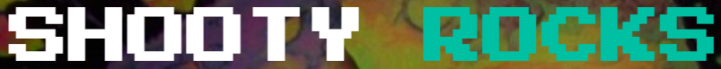
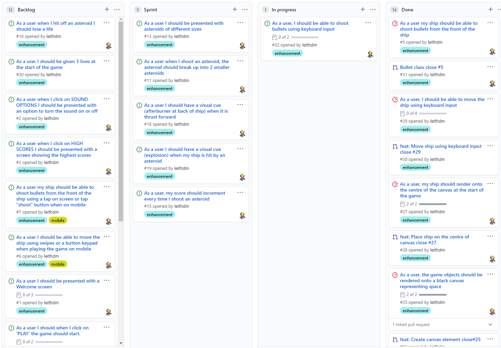

<!--  -->

- [Overview](#overview)
- [UX](#ux)
  - [User Stories](#user-stories)
  - [Design](#design)
    - [Color Scheme](#color-scheme)
    - [Icons](#icons)
    - [Typography](#typography)
  - [Wireframes](#wireframes)
      - [back to top](#back-to-top)
- [Features](#features)
  - [Existing Features](#existing-features)
  - [Future Features](#future-features)
      - [back to top](#back-to-top-1)
- [Technologies Used](#technologies-used)
  - [Miscellaneous Technologies](#miscellaneous-technologies)
  - [Front-End Technologies](#front-end-technologies)
- [Agile Project Management](#agile-project-management)
- [Testing](#testing)
- [Deployment](#deployment)
- [Credits](#credits)
  - [Content](#content)
  - [Media](#media)
  - [Acknowledgments](#acknowledgments)

 

---

## Overview

Covidroids is a remake of the classic *Asteroids* game, with a modern theme. You can view the deployed game [here](https://leithdm.github.io/milestone-project-2/).

 

## UX

This project is part of the [Code Institute](https://codeinstitute.net/) Full Stack Software Development course, specifically **Module 2: Interactive Front-End Development**. The objective for this milestone project is to "*build an interactive front-end site. The site should respond to the users' actions, allowing users to actively engage with data, alter the way the site displays the information to achieve their preferred goals.*"

The inspiration for developing this game came from the classic Asteroids game conceived by Lyle Raines who was Atari's vice president of engineering in 1979. Ed Logg eventually took the lead on the project and is credited with its programming.

 

### User Stories

- User Stories were written from the perspective of the user and the developer.

 

"**__As a *user*, I__** ______________________________________________"

- need to have a responsive game, playable from any device (mobile, tablet, desktop).
- should have an invincibility shield for a set period of time when game restarts.
- should see GAME OVER when I lose all my lives.
- should progress through the game via Levels i.e. Level 1, Level 2, etc.
- should have a triangular ship to match the original game.
- should see irregular shaped asteroids.
- should see an explosion when I shoot an asteroid.
- should be able to turn soundfx on and off as a menu option.
- should hear different sound-fx while playing the game.
- should have a visual cue for the number of lives I have during the game.
- should be able to shoot the asteroids with bullets.
- should be able to shoot bullets using keyboard input.
- should be able to move the ship using keyboard input.
- should be able to move my ship forwards, backwards, left, and right.
- should have my ship render onto the centre of the canvas at the start of the game.
- should feel friction when my ship is no longer moving forward, and my ship should finally stop.
- should be given 3 lives at the start of the game.
- should have a visual cue (explosion) when my ship is hit by an asteroid.
- should have a visual cue (afterburner at back of ship) when my ship is thrust forward.
- should see my score increment every time I shoot an asteroid. Different asteroids get different points.
- should see my ship reappear on the opposite side of the screen if I move off-screen.
- should see the large and medium sized asteroids break up into x2 smaller asteroids when hit by a bullet.
- should find the game easy to begin with, and as the game progresses it should get increasingly more difficult.
- should be able to shoot bullets by tapping a "FIRE" button when on mobile.
- should be able to move the ship using swipes or a button keypad when playing the game on mobile.
- should be able to click on a HIGH SCORES menu button, and be presented with the highest score.
- should be able to click on a SOUND OPTIONS menu button, and be presented with an option to turn sound ON/OFF.
- should be presented with a GAME MENU.
- should be presented with a game that meets accessibility guidelines.

 

"**__As a *developer*, I__** ______________________________________________"

- must maximise future maintainability through documentation, code structure and organisation.
- must document testing fully to include evaluation of bugs found and their fixes, and explanation of any bugs that are left unfixed.
- must test and deploy to a cloud platform.
- must pass HTML/CSS through the official W3C validators with no issues.
- must pass JavaScript code through a linter with no major issues.

 

### Design

Mobile responsiveness was a key design consideration for this project, and resulted in the development of a "gamepad controller" to capture the movements of the ship when playing on movile. The overall concept is aligned with the classic Asteroids game from the 1970's, however there are some notable deviations not least in color scheme and the addition/ommision of certain features.

 

#### Color Scheme

- All of these colors are set at `:root` level within my [style.css](assets/css/style.css) file.

 

#### Icons

- [Font Awesome 5.6.1](https://link) icons are used on the [How To Play](how-to-play.html) page.

 

#### Typography

- The site incorporates [Google Fonts](https://fonts.google.com/) throughout the application. The primary font selected is [Press Start 2P](https://fonts.google.com/specimen/Press+Start+2P).

 

### Wireframes

- Wireframes were created using [Balsamiq Wireframes](https://balsamiq.com/) and can be viewed by clicking on links below.

 

|    Home Page   |    Sound-Options.html     |    High-Scores.html    |
|    :----:      |    :----:                 |    :----:              |
|[Desktop/Mobile](wireframes/home-page.png)|[Desktop/Mobile](wireframes/sound-options.png)|[Desktop/Mobile](wireframes/high-scores-page.png)|

 

##### back to [top](#table-of-contents)

---

## Features

### Existing Features
- lorem

### Future Features
- lorem

##### back to [top](#table-of-contents)

 

---

## Technologies Used

### Miscellaneous Technologies

- [VS Code](https://code.visualstudio.com/) - used as the primary IDE.
- [GitHub](https://github.com/) - used for remote storage of code.
- [TinyPNG](https://tinypng.com/) - used to optimize (.jpg, .png) images for faster loading.
- [Balsamiq](https://balsamiq.com/) - used to create the project's wireframes.

### Front-End Technologies

- [HTML5](https://en.wikipedia.org/wiki/HTML5) - used to provide content and structure.
- [CSS3](https://en.wikipedia.org/wiki/Cascading_Style_Sheets) - used to provide styling.
- [Google Fonts](https://fonts.google.com/) - used to provide font styling.
- [Jasmine](https://jasmine.github.io/) - used for Test-Driven Development (TDD).
- [JavaScript ES6](https://developer.mozilla.org/en-US/docs/Web/JavaScript) - the game is built entirely from vanilla JavaScript.
- [Howler.js](https://github.com/goldfire/howler.js#documentation) - an audio library for the modern web.
- [Am I Responsive?](http://ami.responsivedesign.is/) - used to show site responsiveness.

 

---

## Agile Project Management

[GitHub Projects](https://github.com/features/project-management/) was used to iteratively sprint through the development of this app. Each *User Story* became an individual *Issue*, and was placed in a Kanban board composed of the following columns:
1. **Backlog** - all user stories, ordered by value/priority.
2. **Sprint** - a subset of user stories to be completed in a x1 week sprint.
3. **In Progress** - user stories currently being worked on from current sprint.
4. **Done** - user stories completed, and tested.

 A separate git branch was created for each user story, and a Pull Request (PR) was submitted for its subsequent approval/merger into the master repository. Along with tracking user stories, Github Projects was also used to track bugs. The full list of user stories/bugs and their relevant timestamped PR's **can be viewed [here](https://github.com/leithdm/milestone-project-2/projects/1).**

 

---

## Testing

The testing process can be viewed [here](TESTING.md).

 

---

## Deployment

**To deploy the project:**

This project is hosted in GitHub Pages

1. On the menu on the top of the project’s repository on GitHub select **Settings**.
2. Scroll down to the GitHub **Pages** section.
3. Inside that section, click on the drop-down menu under **Source** and select **Master Branch**.
4. The page refreshes automatically and the website is now deployed.
5. The link to the webpage is just in the GitHub **Pages** section down below.

Only the master branch has been used for this project.

 

**To run the project locally:**

To clone this project from GitHub:

1. Under the repository’s name, click **Clone or download**.
2. In the **Clone with hTTPS** section, copy the given URL.
3. In your IDE of choice, open **Git Bash**.
4. Change the current working directory to the location where you want the cloned directory to be made.
5. Type **git clone**, and then paste the URL copied from GitHub.
6. Press **enter** and a localized clone will be created.

---

## Credits

### Content

- lorem

 

### Media

- [Classic Gaming](http://www.classicgaming.cc/classics/asteroids/) for [audio sounds]([https://link](http://www.classicgaming.cc/classics/asteroids/sounds)) and [background images]([https://link](http://www.classicgaming.cc/classics/asteroids/graphics)) related specifically to the *Asteroids* game. This was an invaluable resource.

 

### Acknowledgments

- [Precious Ijege](https://www.linkedin.com/in/precious-ijege-908a00168/?originalSubdomain=ng) - for his mentorship and guidance.