# Testing <!-- omit in toc -->

## Table of Contents
- [HTML Validator](#html-validator)
  - [W3C HTML Markup Validation Service](#w3c-html-markup-validation-service)
- [CSS Validator](#css-validator)
  - [W3C CSS Validation Service](#w3c-css-validation-service)
- [JavaScript](#javascript)
  - [JSHint](#jshint)
- [Compatability](#compatability)
  - [Manual Testing](#manual-testing)
  - [Automated Testing](#automated-testing)
    - [Test Driven Development](#test-driven-development)
    - [Chrome Dev Tools - Lighthouse](#chrome-dev-tools---lighthouse)
- [User Stories](#user-stories)
- [Bugs](#bugs)
  - [1. Bug: Audio is not playing on mobile #55](#1-bug-audio-is-not-playing-on-mobile-55)
  - [2. Bug: As a user, when I start the game I should not be immediately hit by an asteroid #60](#2-bug-as-a-user-when-i-start-the-game-i-should-not-be-immediately-hit-by-an-asteroid-60)
  - [3. As a user I should be able to move the ship using swipes or a button keypad when playing the game on mobile #6](#3-as-a-user-i-should-be-able-to-move-the-ship-using-swipes-or-a-button-keypad-when-playing-the-game-on-mobile-6)

 

# HTML Validator

## [W3C HTML Markup Validation Service](https://validator.w3.org/)

 

- Menu Page (index.html)

 

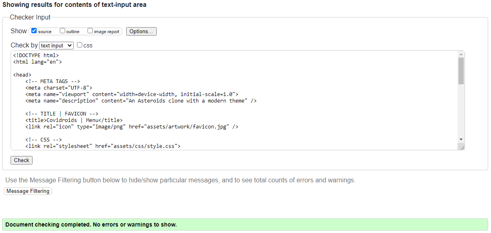

**Result:** No Errors or warnings

----------

 

- Game Page (game.html)

 

**Result:** No Errors or warnings

----------

 

- High Score Page (high-score.html)

 

**Result:** No Errors or warnings

----------

 

- How To Play Page (how-to-play.html)

 

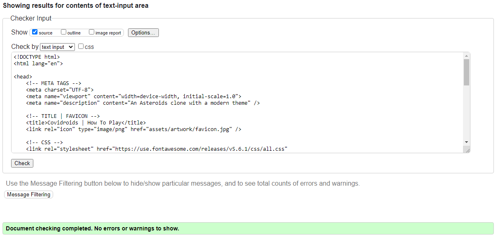

**Result:** No Errors or warnings

----------

 

- Sound Page (sound.html)

 

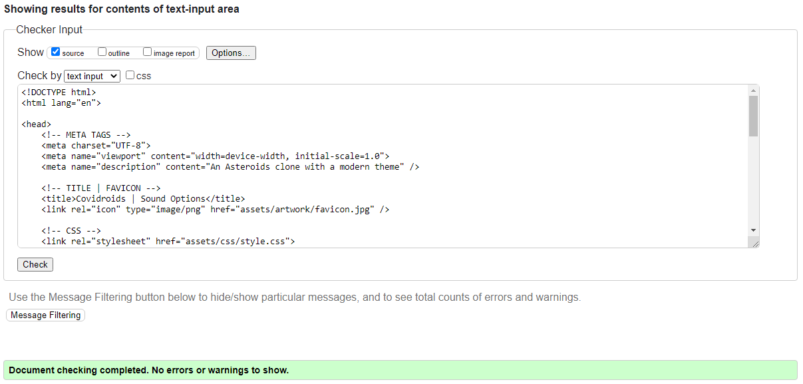

**Result:** No Errors or warnings

----------

# CSS Validator

## [W3C CSS Validation Service](https://jigsaw.w3.org/css-validator/)

 

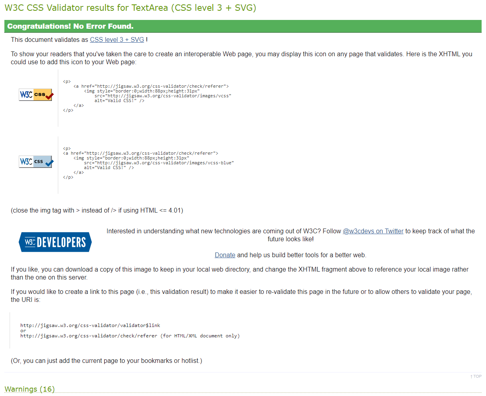

**Result:** No Errors, 16 warnings. The validator found x16 generic warnings related to border extensions for 'moz' and 'webkit'. Other warnings are related to using css custom properties/variables for color designation, and touch gestures related to the keypad controller. All of these warnings are ignored.

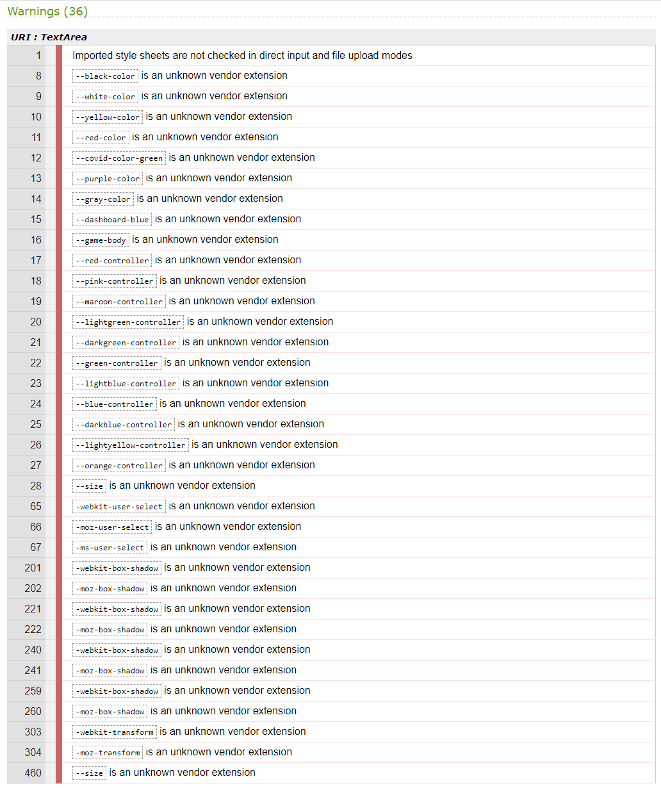

 

----------

# JavaScript

## [JSHint](https://jshint.com/)

- File: [asteroid.js](assets/testing/src/asteroid.js)

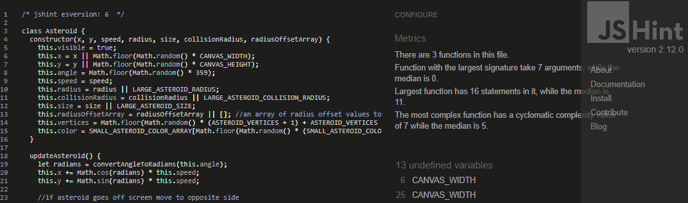

**Result:** [No Errors](assets/testing/results/jshint-asteroid-testing.PNG) with x11 undefined variables (*ignored*).

- File: [bullet.js](assets/testing/src/bullet.js)

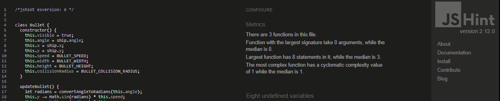

**Result:** [No Errors](assets/testing/results/jshint-bullet-testing.PNG) with x8 undefined variables (*ignored*).

- File: [game.js](assets/testing/src/game.js)

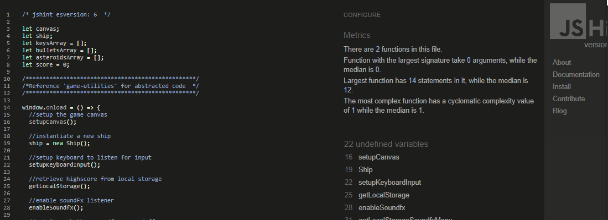

**Result:** [No Errors](assets/testing/results/jshint-game-testing.PNG) with x20 undefined variables (*ignored*).

- File: [game-utilities.js](assets/testing/src/game-utilities.js)

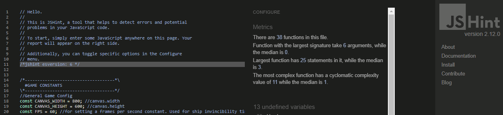

**Result:** [No Errors](assets/testing/results/jshint-game-utilities-testing.PNG) with x13 undefined variables (*ignored*).

- File: [ship.js](assets/testing/src/ship.js)

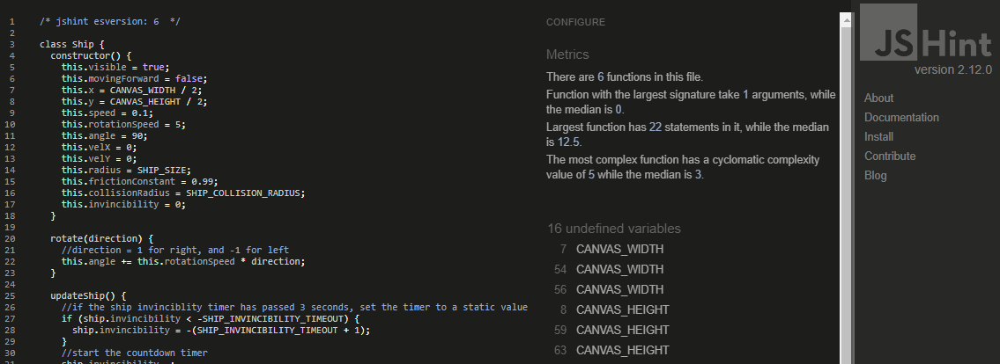

**Result:** [No Errors](assets/testing/results/jshint-ship-testing.PNG) with x14 undefined variables (*ignored*).

- File: [sound.js](assets/testing/src/sound.js)

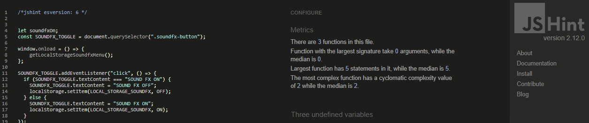

**Result:** [No Errors](assets/testing/results/jshint-sound-testing.PNG) with x3 undefined variables (*ignored*).

 

----------

# Compatability

## Manual Testing

- Browser compatability: To ensure a broad range of users can successfully use this site, it was manually tested across the 6 major browsers:

  - Chrome v.85
  - Edge v.85
  - Firefox v.81
  - Safari v.12
  - Opera v.71
  - Internet Explorer v.6-11 (tested via [Browserstack](https://www.browserstack.com/test-in-internet-explorer)).

 

- Site responsiveness was tested using [Chrome DevTools](https://developers.google.com/web/tools/chrome-devtools) using profiles for a wide variety of devices.

 

- Physical Devices tested included an iPhone 5, Samsung Galaxy A10, MacBook Pro 13", Apple iMac 27" (running OSX and Windows 10).

 

**Result:** Both browser compatability and site responsiveness testing can be summarised in the table below. Responsiveness was good on all of the devices listed, both physical and simulated. Brower compatability was good across all the major browsers, except for Internet Explorer 6-11 where both the `canvas` and `grid` elements are only partially supported, or not supported at all (reference [IE canvas support](https://caniuse.com/?search=canvas) and [IE grid support](https://caniuse.com/?search=grid)).

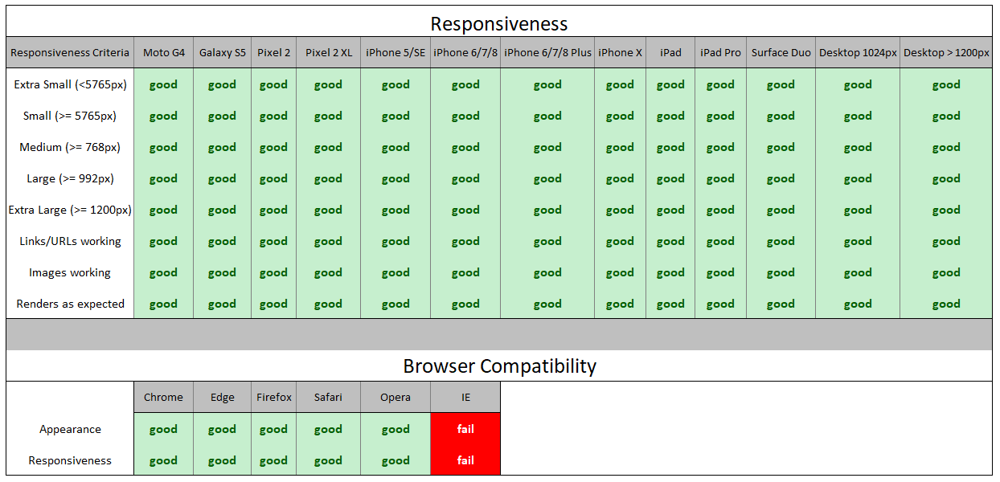

 

**IE browser incompatibility:** Lack of support for `canvas` and `grid` elements. Screenshot below shows *game.html* as displayed in IE 11.

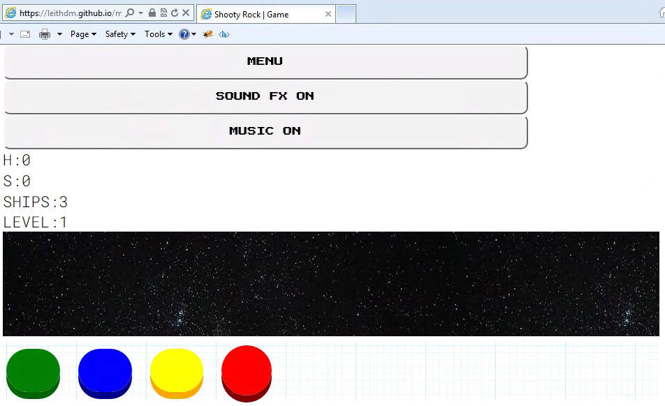

 

----------

## Automated Testing

### Test Driven Development

TDD was employed on this project when creating and interacting with the Asteroid, Bullet and Ship objects. The TDD cycle followed the red, green, refactor approach (...read more on this methodology via this [codecademy article](https://www.codecademy.com/articles/tdd-red-green-refactor)).

[Jasmine 3.6.0](https://jasmine.github.io/) was used to automate these tests, and they can be found in the [testing/spec](assets/testing/spec) folder. To run all of the automated tests use the [spec-runner.html](assets/testing/spec-runner.html) file.

**Result:** 46 specs, 0 failures.

 

----------

### Chrome Dev Tools - Lighthouse

Further automated testing was performed using [Chrome Dev Tools - Lighthouse](https://developers.google.com/web/tools/lighthouse). Lighthouse is an open-source, automated tool for improving the quality of web pages. It performs audits under the following headers:
1. Performance
2. Accessibility
3. Best Practices
4. SEO

**Result:** see summary results below for **Desktop *game.html***

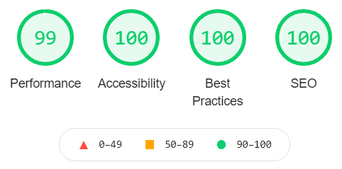

- View the full desktop game.html report [here](assets/testing/results/lighthouse-desktop-report.html)

 

**Result:** see summary results below for **Mobile *game.html***

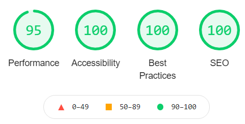

- View the full mobile game.html report [here](assets/testing/results/lighthouse-mobile-report.html)

**Conclusion:** Performance improvements are recommended in the following areas:
- **Enable text compression:** in order to help the page load faster by up to 1.05s, it is recommended to compress the .js and .css files. It is also recommended to minify the .js to reduce payload sizes by up to 0.45s.
- **Remove invisible text:** there is a flash of invisible text (FOIT) while the *game.html* page waits on Font-Awesome to load. The game-pad controller briefly displays blank text for the up, left, and right button icons.
- **Use passive listeners to improve scrolling performance:** the browser does not know if the event listeners on *game.html* will prevent scrolling, so it waits for the listener to finish executing before scrolling the page. The recommendation is to add a `passive` flag to every event listener e.g.

`document.addEventListener('touchstart', onTouchStart, {passive: true});`

- As the project is sitting at 99% performance on Desktop, and 95% on Mobile, the suggestions are taken under advisement, but are not implemented at this point in time.

 

----------

# User Stories

**Result:** All user stories have been successfully implemented, with a :white_check_mark: to denote items that have been implemented in this game.
- The full list of **user stories with relevant screenshots** can be viewed in this [document](assets/testing/results/user-story-checklist.pdf).

 

"**__As a user, I__** ______________________________________________"

- :white_check_mark: need to have a responsive game, playable from any device (mobile, tablet, desktop).
- :white_check_mark: should have an invincibility shield for a set period of time when game restarts.
- :white_check_mark: should see GAME OVER when I lose all my lives.
- :white_check_mark: should progress through the game via Levels i.e. Level 1, Level 2, etc.
- :white_check_mark: should have a triangular ship to match the original game.
- :white_check_mark: should see irregular shaped asteroids.
- :white_check_mark: should see an explosion when I shoot an asteroid.
- :white_check_mark: should be able to turn soundfx on and off as a menu option.
- :white_check_mark: should hear different sound-fx while playing the game.
- :white_check_mark: should have a visual cue for the number of lives I have during the game.
- :white_check_mark: should be able to shoot the asteroids with bullets.
- :white_check_mark: should be able to shoot bullets using keyboard input.
- :white_check_mark: should be able to move the ship using keyboard input.
- :white_check_mark: should be able to move my ship forwards, backwards, left, and right.
- :white_check_mark: should have my ship render onto the centre of the canvas at the start of the game.
- :white_check_mark: should feel friction when my ship is no longer moving forward, and my ship should finally stop.
- :white_check_mark: should be given 3 lives at the start of the game.
- :white_check_mark: should have a visual cue (explosion) when my ship is hit by an asteroid.
- :white_check_mark: should have a visual cue (afterburner at back of ship) when my ship is thrust forward.
- :white_check_mark: should see my score increment every time I shoot an asteroid. Different asteroids get different points.
- :white_check_mark: should see my ship reappear on the opposite side of the screen if I move off-screen.
- :white_check_mark: should see the large and medium sized asteroids break up into x2 smaller asteroids when hit by a bullet.
- :white_check_mark: should find the game easy to begin with, and as the game progresses it should get increasingly more difficult.
- :white_check_mark: should be able to shoot bullets by tapping a "FIRE" button when on mobile.
- :white_check_mark: should be able to move the ship using swipes or a button keypad when playing the game on mobile.
- :white_check_mark: should be able to click on a HIGH SCORES menu button, and be presented with the highest score.

 

----------

# Bugs

Using GitHub Projects, **a full list of bugs can be found [here](https://github.com/leithdm/milestone-project-2/issues?q=label%3Abug+is%3Aclosed+project%3Aleithdm%2Fmilestone-project-2%2F1)**. In this section we will highlight some of the more interesting ones.

## 1. [Bug: Audio is not playing on mobile #55](https://github.com/leithdm/milestone-project-2/issues/55)

Audio was originally added to the game using standard Audio() object instantiation:

`let audio = new Audio();
audio.play();`

  // see original code [here](https://github.com/leithdm/milestone-project-2/pull/53/commits/5d11760f70c9aeffe6cdade6a3197f76c360b31e)

This code worked fine on Desktop, but when testing on a physical Mobile device (Samsung Galaxy A10, iPhone 5), the audio would not play. Research revealed the [many]([https://link](https://pupunzi.open-lab.com/2013/03/13/making-html5-audio-actually-work-on-mobile/))  issues that can crop up when adding audio to a mobile game, mostly due to browser/performance limitations. The solution was to make use of the 3rd party [Howler.js](https://howlerjs.com/) library. By linking to the holwer.js cdn, and adding code like below, mobile audio worked.

`const fireSound = new Howl({
  src: ["assets/audio/fire.webm", "assets/audio/fire.mp3"]});`

//see full solution code [here](https://github.com/leithdm/milestone-project-2/commit/82aa0e5f8b65385c9f0d2259552034d540a39c1a)

 

## 2. [Bug: As a user, when I start the game I should not be immediately hit by an asteroid #60](https://github.com/leithdm/milestone-project-2/issues/60)

When starting a new game, or restarting with a new life, the ship is placed in the centre of the screen. However, there was always a possibility that an asteroid would immediately collide with the ship, giving the player no time to react. This bug was resolved in 2 parts:
1. For a **new game**, create a collision zone which cannot be entered by an asteroid.
2. For a **new life**, make the ship invincible for a set period of time.

Item 1, *new game*,  was solved using the code below. The idea was to randomly place the asteroid on the canvas, provided it does not collide with the ship within a specific radius:

`for (let i = 0; i < NUMBER_OF_ASTEROIDS; i++) {
  do { x = Math.floor(Math.random() * canvasWidth);
       y = Math.floor(Math.random() * canvasHeight);
      } while (collisionDetection(x,y,LARGE_ASTEROID_SIZE,ship.x,ship.y,ship.collisionRadius * 20));
      asteroidsArray.push(new Asteroid(x, y));
    }`

//see full solution code [here](https://github.com/leithdm/milestone-project-2/pull/63/commits/8b086b5ec1e37de1f4756eb1e2ba425ac7ffa1cc)

Item 2, *new life*,  was more complicated, and required a 3-second countdown timer `SHIP_INVINCIBILITY_TIMEOUT`, as well as ensuring there was no collision detection between asteroids and the ship during this time period, and finally displaying an invincibility cloak for the ship.

//see full solution code [here](https://github.com/leithdm/milestone-project-2/commit/31a63c9a7b565079931cd3d85d4c32d43870c858)

 

## 3. [As a user I should be able to move the ship using swipes or a button keypad when playing the game on mobile #6](https://github.com/leithdm/milestone-project-2/issues/6)

On mobile, this game required the development of a gamepad controller. The controller had to be designed for usability, meaning button positioning and size required serious consideration.

- Initally, I coded a touch controller within a second `canvas` element, resulting in **Controller 1.0** :

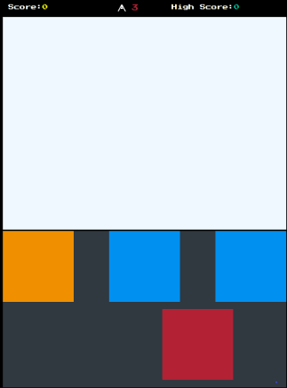

The issue with this controller was that it was difficult to make the buttons mobile responsive across a large number of devices.

- To solve this bug, I moved over to `button` elements, abandoning the `canvas` element. This resulted in **Controller 2.0** :

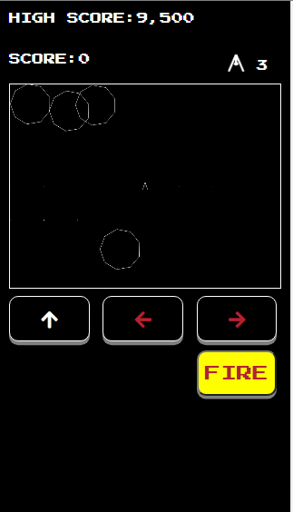

- Buttons were now fully responsive, and easier to style. With further styling, I settled on **Controller 3.0** :

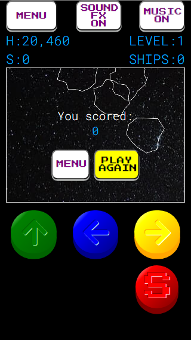

[Go back to README.md file](README.md).

